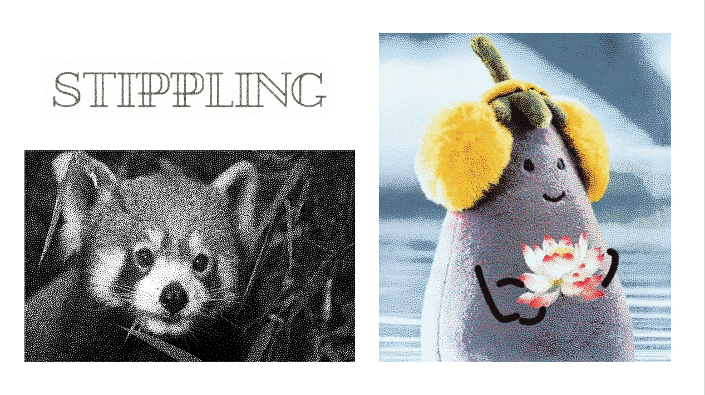
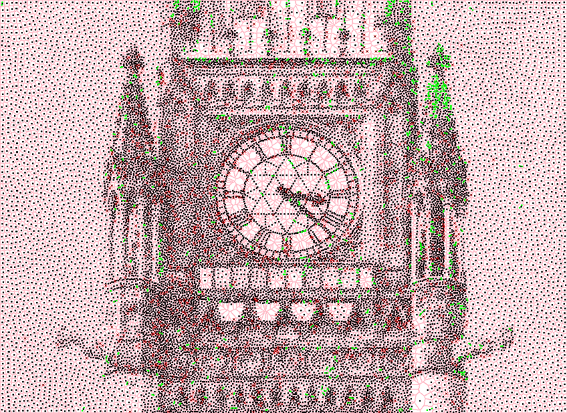
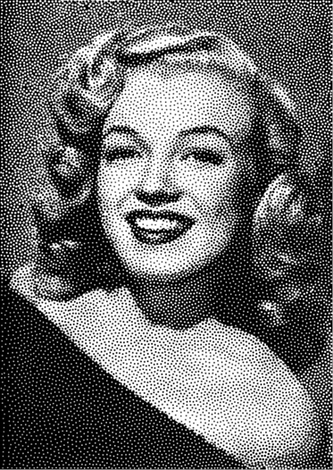
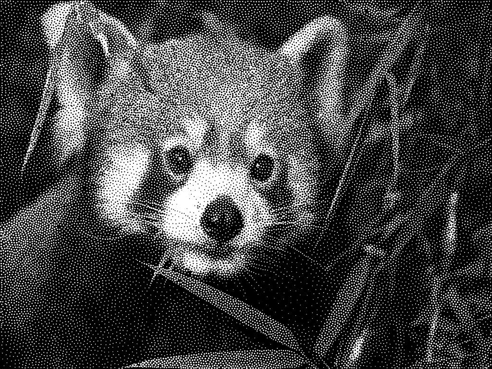
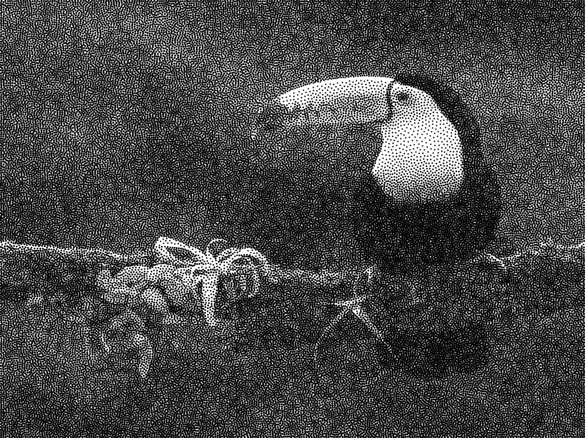
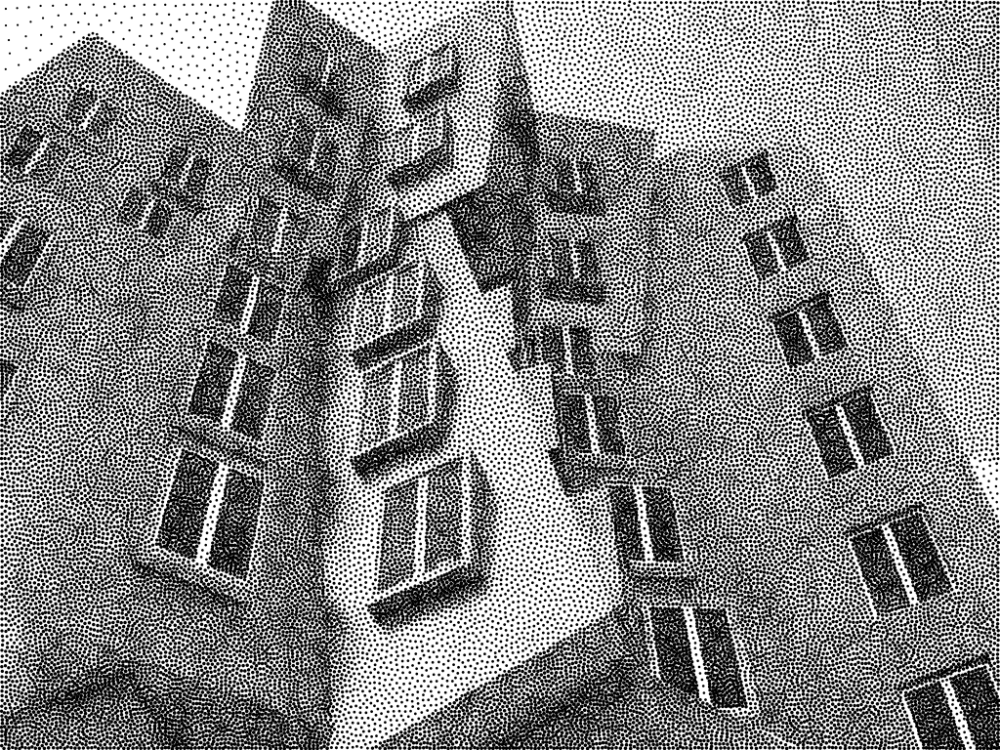
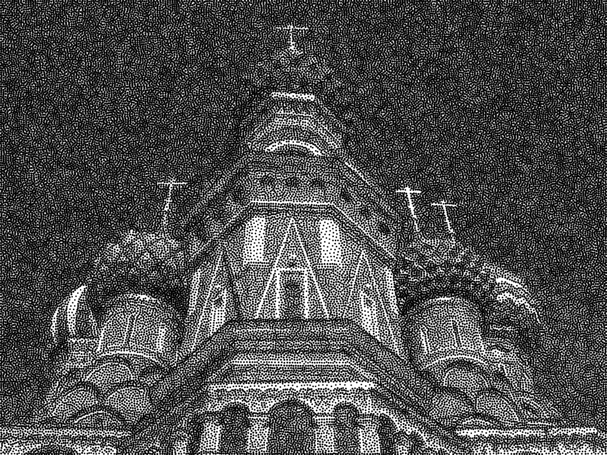
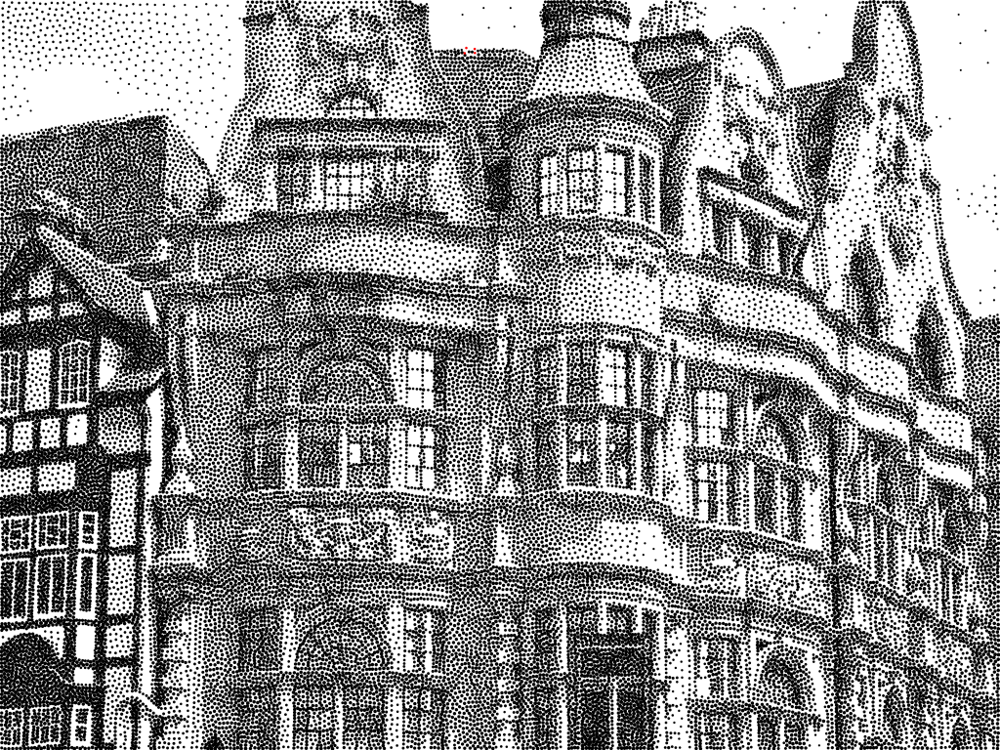

# Stippling

CSCI 2240 Final Project for the Spring 2024 by Stippling Studio ([Chengfan Li](https://github.com/lllllcf), [Wendi Liao](https://github.com/wendi-liao) and [Yixuan Liu](https://github.com/Ahhhh2016))

Special thanks to the papers "[Weighted Linde-Buzo-Gray Stippling](https://graphics.uni-konstanz.de/publikationen/Deussen2017LindeBuzoGray/index.html)" and "[Multi-class Inverted Stippling](https://kops.uni-konstanz.de/bitstreams/21672707-75c4-410b-a4ff-87b21c2ed630/download)" that inspired this project.

\[[Demo Video](https://drive.google.com/file/d/1Hk2hPs_mVhhbz9oe8zTLfxnnQoMRPXu8/view?usp=drive_link)\]

## Overview

Based on the research and exploration of stippling, we have implemented the following features.

+ Weighted LBG algorithm based stippling that can convert grayscale image to stippling.

+ Visualization of Voronoi diagrams, as well as splitting and merging of points.

+ Video stippling with low noise and minimal flickering using WLGB.

+ Multi-class Inverted Stippling for grayscale image.

+ Color Stippling with palette extraction.

+ UNet-based reconstruction model to restore stippling to grayscale images.

  

## WLBG

### Voronoi Diagram

Voronoi diagrams can be used to create a variety of amazing visual effects including stippling. In this project, we use [jc_voronoi](https://github.com/JCash/voronoi) to calculate voronoi diagram efficiently and assign pixels to voronoi cell based on edges and site position.

### Running the Application
#### Prerequisites
Before running the application, ensure that changing the working directory to the WLBG directory, and put `./inis/test.ini` in the command line arguments.

#### Starting the Application
Ensure you are at the WLBG project, either Release mode or Debug mode. Click the run button on Qt.

#### Using the Application
Once the application is running, you will see a GUI that allows you to interact with the application's features:

+ Clear Canvas: Clears all current drawings or data on the canvas.
+ Load Image: Allows you to load an image from your computer to the application for processing.
+ Stippling: Convert the loaded image into a stippled art form using Voronoi diagrams.
+ Draw Voronoi Diagram: Generates and displays a Voronoi diagram based on the stippled points.

#### Exiting the Application
To exit the application, you can simply close the application window or use the exit option within the application menu, if available.

### Video Stippling

We haven't integrated video stippling on the master branch yet, but there are some helpful python scripts included in the [VideoStippling](./VideoStippling) folder.

+ `toframe.py` convert video to frames based on the fps of the original video.
+ `tovideo.py` convert frames from `out_frame` folder to video.

So in order to turn the video into stippling, `toframe.py` should be first to used to turn the video into frames, then perform stippling frame by frame, and finally convert processed frames into a video again using `tovideo.py`.

## MLBG

## Color Stippling

## Reconstruction

## Gallery

    

    

  

## References

Deussen, Oliver, Marc Spicker, and Qian Zheng. "Weighted linde-buzo-gray stippling." *ACM Transactions on Graphics (TOG)* 36.6 (2017): 1-12.

Christoph Schulz, Kin Chung Kwan, Michael Becher, Daniel Baumgartner, Guido Reina, Oliver Deussen, and Daniel Weiskopf. 2021. Multi-Class Inverted Stippling. *ACM Trans*. Graph. 40, 6 (2021)

Tan, J., Echevarria, J. and Gingold, Y., 2018. Efficient palette-based decomposition and recoloring of images via RGBXY-space geometry. ACM Transactions on Graphics (TOG), 37(6), pp.1-10.

