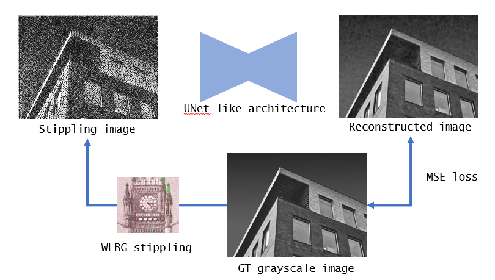
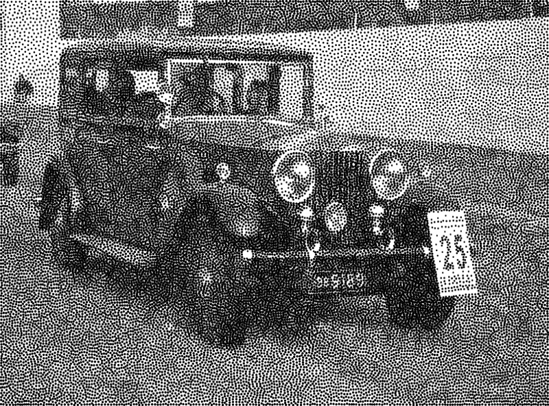
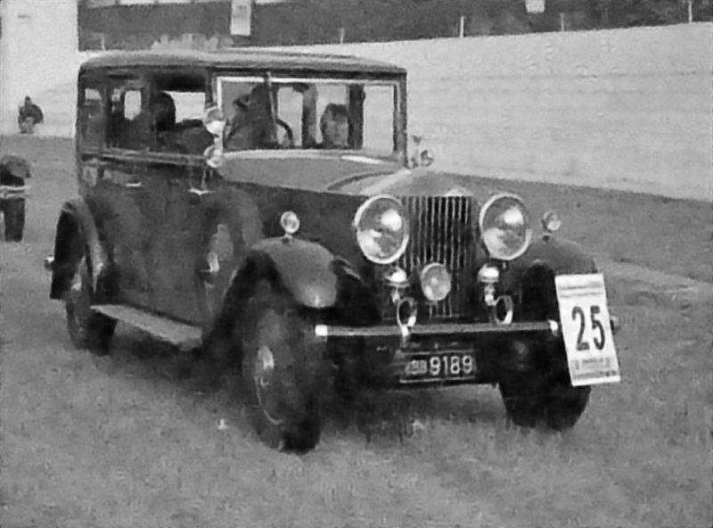
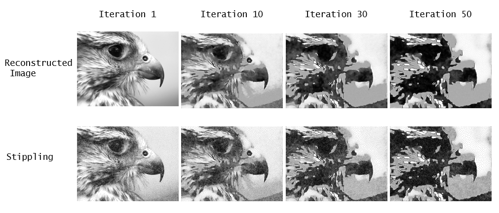

# Stippling

CSCI 2240 Final Project for the Spring 2024 by Stippling Studio ([Chengfan Li](https://github.com/lllllcf), [Wendi Liao](https://github.com/wendi-liao) and [Yixuan Liu](https://github.com/Ahhhh2016))

Special thanks to the papers "[Weighted Linde-Buzo-Gray Stippling](https://graphics.uni-konstanz.de/publikationen/Deussen2017LindeBuzoGray/index.html)" and "[Multi-class Inverted Stippling](https://kops.uni-konstanz.de/bitstreams/21672707-75c4-410b-a4ff-87b21c2ed630/download)" that inspired this project.

\[[Demo Video](https://drive.google.com/file/d/1Hk2hPs_mVhhbz9oe8zTLfxnnQoMRPXu8/view?usp=drive_link)\]

## Overview

Based on the research and exploration of stippling, we have implemented the following features.

+ Weighted LBG algorithm based stippling that can convert grayscale image to stippling.

+ Visualization of Voronoi diagrams, as well as splitting and merging of points.

+ Video stippling with low noise and minimal flickering using WLGB.

+ Multi-class Inverted Stippling for grayscale image.

+ Color Stippling with palette extraction.

+ UNet-based reconstruction model to restore stippling to grayscale images.

## WLBG

### Voronoi Diagram

Voronoi diagrams can be used to create a variety of amazing visual effects including stippling. In this project, we use [jc_voronoi](https://github.com/JCash/voronoi) to calculate voronoi diagram efficiently and assign pixels to voronoi cell based on edges and site position.

### Running the Application
#### Prerequisites
Before running the application, ensure that changing the working directory to the WLBG directory, and put `./inis/test.ini` in the command line arguments.

#### Starting the Application
Ensure you are at the WLBG project, either Release mode or Debug mode. Click the run button on Qt.

#### Using the Application
Once the application is running, you will see a GUI that allows you to interact with the application's features:

+ Clear Canvas: Clears all current drawings or data on the canvas.
+ Load Image: Allows you to load an image from your computer to the application for processing.
+ Stippling: Convert the loaded image into a stippled art form using Voronoi diagrams.
+ Draw Voronoi Diagram: Generates and displays a Voronoi diagram based on the stippled points.

#### Exiting the Application
To exit the application, you can simply close the application window. The result will be in the output directory.

### Video Stippling

We haven't integrated video stippling on the master branch yet, but there are some helpful python scripts included in the [VideoStippling](./VideoStippling) folder.

+ `toframe.py` convert video to frames based on the fps of the original video.
+ `tovideo.py` convert frames from `out_frame` folder to video.

So in order to turn the video into stippling, `toframe.py` should be first to used to turn the video into frames, then perform stippling frame by frame, and finally convert processed frames into a video again using `tovideo.py`.

## MLBG

### Running the Application
#### Prerequisites
Before running the application, ensure that changing the working directory to the MLBG directory, and put `./inis/test.ini` in the command line arguments.

#### Starting the Application
Ensure you are at the MLBG project, either Release mode or Debug mode. Click the run button on Qt.

#### Using the Application
The GUI is similar to WLBG's, only with a few more features:

+ Multiple Stippling: Convert the loaded image into a stippled art form using Multi-class Inverted Stippling technique.
+ Fill Background: After showing the animation of Multi-class Inverted Stippling, another LBG stippling process will be shown to fill the background.
#### Exiting the Application
To exit the application, you can simply close the application window. The result will be in the output directory.

## Color Stippling

### Running the Application

#### Prerequisites

Before running the application, ensure that changing the working directory to the MLBG directory, and put `./inis/test.ini` in the command line arguments.

#### Starting the Application

Ensure you are at the MLBG project, either Release mode or Debug mode. Click the run button on Qt.

#### Using the Application

The GUI is similar to WLBG's, only with a few more features:

+ Palette Selection:   This is done by the Python program Pylette. It will generate the selected palette from  'image_path' in `./inis/test.ini` and write the result into 'palette' in `./inis/test.ini`. The `image_path` should be an absolute path. When running it, simply use `python run.py` in the Pylette folder.
+ Layer Image Generation: This is done by the Python program Unmixer. It will generate layer images based on the image from 'image_path' in `./inis/test.ini` and the color selection from 'palette' in `./inis/test.ini`. The `image_path` should be an absolute path. When running it, simply use `python run.py` in the Unmixer folder.
+ Color Stippling: Click the 'Load Image' button to load the target image. Then, click the 'Color Stippling' button to generate the color stippling version of the loaded image. This process will automatically invoke Palette Selection and Layer Image Generation first. It may cause the application to become unresponsive. Users should wait patiently; the status can be viewed on the output page of Qt Creator. The final image can be viewed in the window.
+ Fill Color: Click the "Load Image" button to load the target image. Then, click the "Fill Color" button to generate the color stippling version of the loaded image with the filling effect. The process before filling is similar to "Color Stippling."

#### Exiting the Application

To exit the application, you can simply close the application window. The result will be in the output directory.

## Reconstruction

### Usage

+ Follow the instruction in the **Data** section to download the pre-trained model and training data.

+ `reconstruction_all.ipynb` contains all training code for the model.
+ You can evaluate the model on your own stippling images using `evaluate.py`.

### Data

[Pre-trained model](https://drive.google.com/file/d/1wNgoFfu8BveQth--_sxytfBQHz6F83pZ/view?usp=drive_link): download from gdrive and put into [checkpoints](./Reconstruction/checkpoints) folder.

[Processed data for training](https://drive.google.com/drive/folders/1WmYop4yAKnwpcS6ffFvmi2NawybhoEtK?usp=drive_link): download from gdrive and put into [data](./Reconstruction/data) folder.

[Raw data](https://drive.google.com/file/d/1ddujNdD7BLoh5h58VGwizlL-kDieatXy/view?usp=drive_link): contains all color images and grayscale images without preprocessing.

### Results

 

Use [this link](https://drive.google.com/file/d/1rNqYqDoWK2uVU3JlxZ1rmFFiMoJb_Uys/view?usp=drive_link) to download the results of all images in the test set.

### Stippling-Reconstruction Iterations

Here is the result obtained after using our model to continuously perform the Stippling-Reconstruction cycle on the grayscale image. Detailed results can be found [here](./Reconstruction/repeat_test/data).

## Gallery

    

    

  

## References

Deussen, Oliver, Marc Spicker, and Qian Zheng. "Weighted linde-buzo-gray stippling." *ACM Transactions on Graphics (TOG)* 36.6 (2017): 1-12.

Christoph Schulz, Kin Chung Kwan, Michael Becher, Daniel Baumgartner, Guido Reina, Oliver Deussen, and Daniel Weiskopf. 2021. Multi-Class Inverted Stippling. *ACM Trans*. Graph. 40, 6 (2021)

Tan, J., Echevarria, J. and Gingold, Y., 2018. Efficient palette-based decomposition and recoloring of images via RGBXY-space geometry. ACM Transactions on Graphics (TOG), 37(6), pp.1-10.

